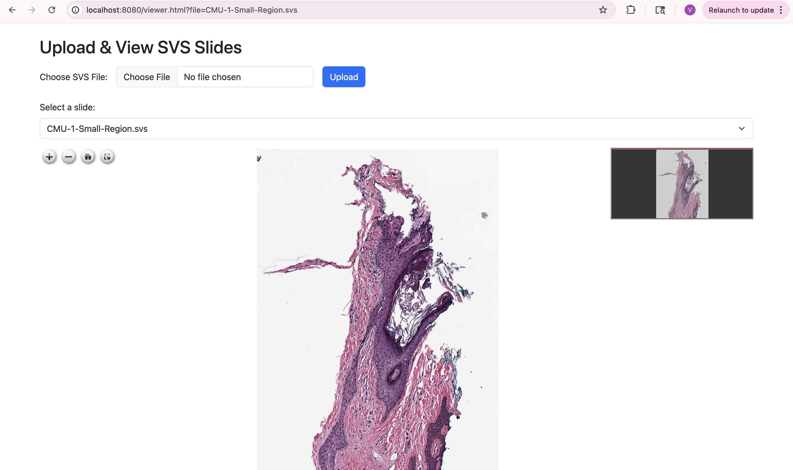

# 🧪 Pathology SVS Viewer

A web-based digital pathology slide viewer built with Docker, PHP, OpenSeadragon, and Cantaloupe (OpenSlide backend).

---

## 🔍 Features

- Upload `.svs` pathology slide files
- View high-resolution slides with zoom and pan
- Dockerized setup with PHP or Java backend + Apache + Cantaloupe
- Clean UI with file dropdown and OpenSeadragon viewer

---

## 📋 Table of Contents

- [Getting Started](#-getting-started)
- [Usage](#-usage)
- [Folder Structure](#-folder-structure)
- [Screenshots](#-screenshots)
- [License](#-license)

---

## 🚀 Getting Started

### ✅ Prerequisites

- [Docker](https://www.docker.com/)
- [Docker Compose](https://docs.docker.com/compose/)
- For Java Backend: [Java 17](https://adoptium.net/en-GB/temurin/releases/) and [Maven](https://maven.apache.org/)

### ▶️ Run Locally (Java Backend Version)

```bash
git clone https://github.com/rishitha07/pathology-svs-viewer.git
cd pathology-svs-viewer
docker-compose up --build
```

This will start the following containers:

📦 Apache + PHP frontend (http://localhost:8080)

🧠 Cantaloupe IIIF image server (http://localhost:8182)

☕ Java Spring Boot backend (http://localhost:9086)

🛢️ MySQL database (localhost:3306) (optional, used for logging uploads)

✅ If you want to run with the old PHP backend instead, replace the backend service in docker-compose.yml.

## 📂 Usage
🔼 Uploading Slides
Upload .svs files using the form on viewer.html

Files are stored in the uploads/ directory and served via Cantaloupe

🔎 View Slides
UI Viewer:
Open http://localhost:8080/viewer.html

Direct IIIF URL (for testing):

http://localhost:8182/iiif/2/CMU-1-Small-Region.svs/full/full/0/default.jpg

Testing Backend API (Java)
POST /upload: Upload SVS file
http://localhost:9086/upload

GET /slides: Get list of uploaded SVS files
http://localhost:9086/slides

## 📁 Folder Structure

pathology-svs-viewer/
├── apache-php/ or apache-frontend/
│   ├── viewer.html         # UI page
│   ├── upload.php          # (For PHP backend)
│   ├── list_files.php      # (For PHP backend)
│   └── screenshots/
│       └── Screenshot-Viewer.png
├── backend/                # Java Spring Boot backend
│   └── src/main/java/com/viewer/backend/
│       ├── controller/
│       │   ├── FileUploadController.java
│       │   └── SlideListController.java
│       └── PathologyViewerApplication.java
├── uploads/                # SVS file mount directory
├── Dockerfile.cantaloupe  # Image server Dockerfile
├── docker-compose.yml     # Combined setup
├── cantaloupe.properties  # Cantaloupe config
└── README.md


## 📸 Screenshots

### Slide Viewer UI


## 📄 License
This project is licensed under the MIT License.


